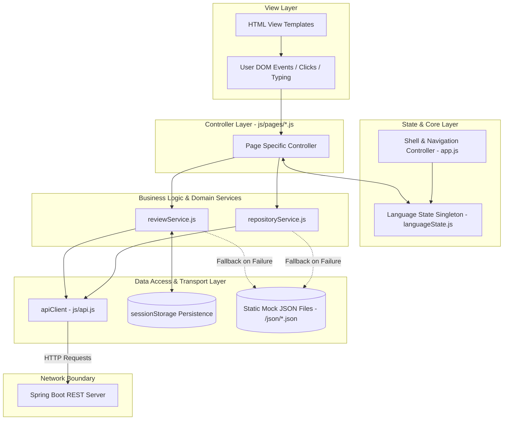
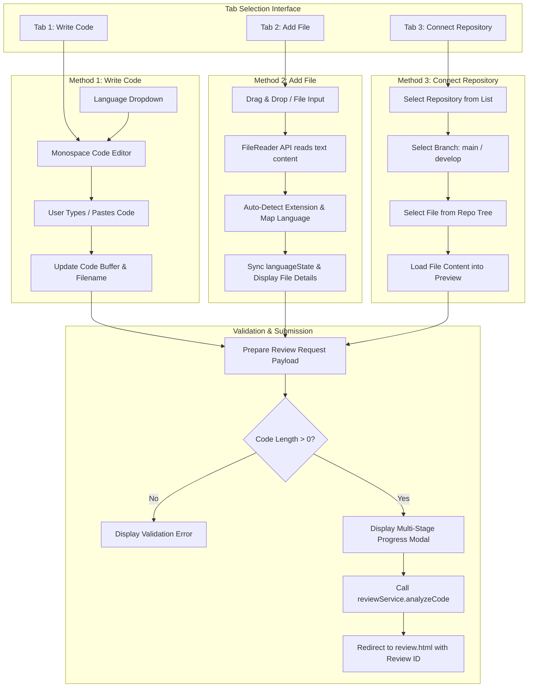
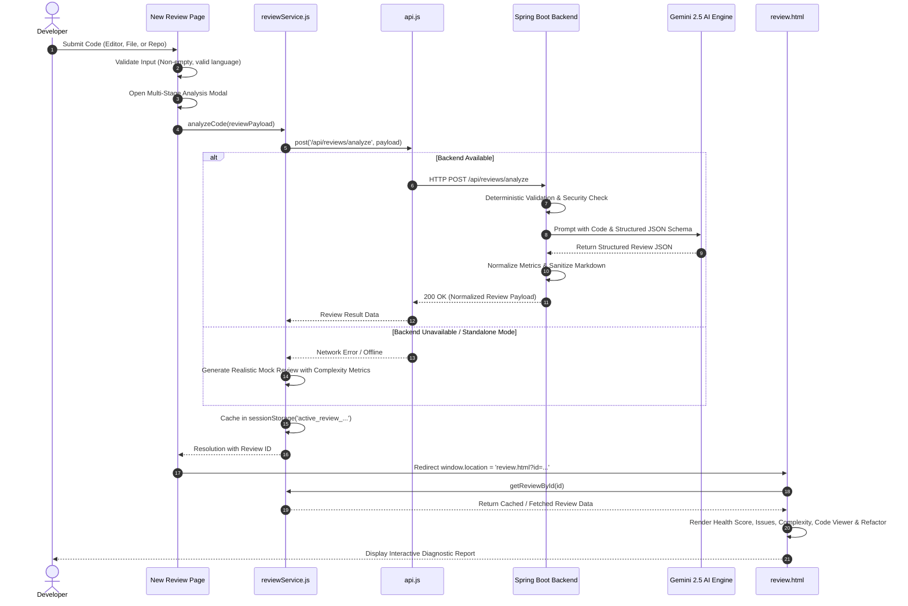
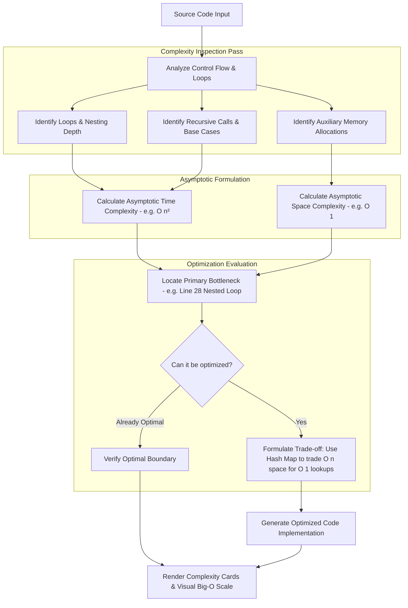
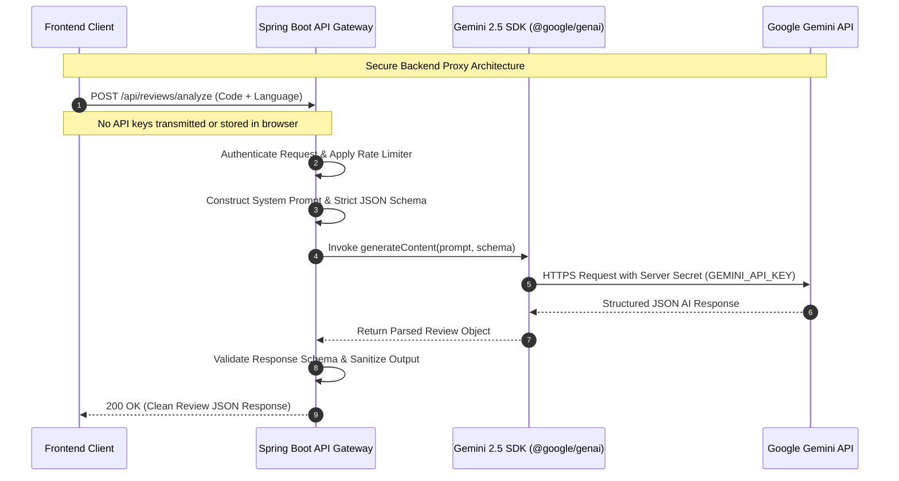
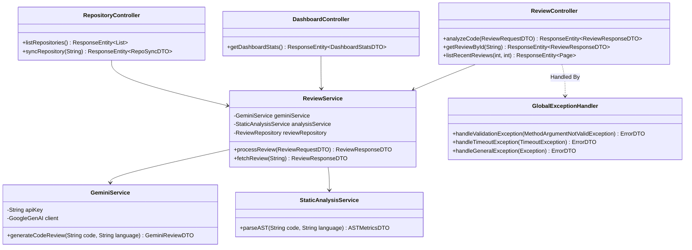
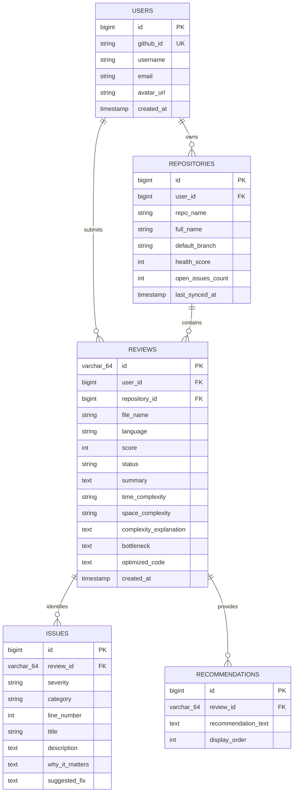

# AI Code Reviewer

> **Understand Your Code. Improve It. Ship With Confidence.**  
> An AI-powered code review and algorithmic complexity analysis platform designed to help software engineers inspect, debug, optimize, and master source code with mentor-style feedback.

---

## 1. Project Title & Tagline

**AI Code Reviewer** is a web-based code intelligence platform engineered to transform ordinary code inspection into an interactive learning and quality assurance experience. Built with a clean separation of concerns and an API-ready architecture, it provides automated code health diagnostics, vulnerability detection, Big-O time and space complexity evaluations, and drop-in optimized refactoring recommendations.

---

## 2. Project Overview

### What the Project Is
AI Code Reviewer is an interactive developer tool that analyzes source code across multiple programming languages. It evaluates syntactic correctness, runtime safety, software architecture patterns, and algorithmic performance, returning a comprehensive review report structured around actionable, educational feedback.

### The Problem It Solves
Traditional static analyzers and linters enforce style conventions and detect known AST-level anti-patterns, but they frequently fail to:
- Explain **why** an algorithmic implementation will degrade under production loads.
- Offer **context-aware refactoring solutions** tailored to the specific problem domain.
- Provide a unified, human-readable breakdown of **Time and Space complexity** (Big-O notation).
- Act as an educational mentor for developers seeking to sharpen their engineering craftsmanship.

### Target Audience
- **Software Engineers & Backend Developers**: Requiring a pre-flight sanity check before opening peer Pull Requests.
- **Computer Science Students & Competitive Programmers**: Analyzing algorithmic efficiency, identifying bottlenecks, and understanding asymptotic bounds.
- **Engineering Leads & Technical Mentors**: Establishing consistent code quality baselines and speeding up manual code review cycles.

### How It Differs From Basic Code Checkers
| Dimension | Traditional Linters & Checkers | AI Code Reviewer |
| :--- | :--- | :--- |
| **Analysis Depth** | Syntax, formatting, and rigid static rules | Algorithmic logic, edge cases, scalability, and code smell identification |
| **Feedback Tone** | Cryptic error codes (e.g., `W0611`, `E501`) | Senior mentor rationale detailing root cause and significance |
| **Complexity Analysis** | Cyclomatic complexity counters only | Asymptotic Time & Space complexity ($O(n)$, $O(n \log n)$, etc.) |
| **Refactoring** | Automatic whitespace/token fixing | Complete, contextual before-and-after optimized implementations |
| **Language Portability** | Language-specific CLI binaries required | Unified multi-language web workspace supporting 9 major languages |

---

## 3. Key Features

### Implemented Features (Current Frontend State)
- **Frontend API Mode Switcher & Mock Engine (`mockApi.js`)**: Built-in, standalone mock mode active by default. Simulates network latency and endpoint routing entirely client-side, requiring zero backend services or Gemini API keys. Guaranteed zero `localhost:8080` connection errors during Live Server testing.
- **Developer Simulation Controls**: Configurable simulated network latency (50ms, 350ms, 800ms) and an intentional API error simulation toggle in Settings for comprehensive UI testing.
- **Interactive Code Editor ("Write Code")**: In-browser monospace editor featuring real-time line numbering, code indentation, language indicators, quick-copy, buffer clearing, and automatic starter template injection.
- **Multi-Format File Uploader ("Add File")**: Drag-and-drop file ingestion supporting manual file selection, file extension auto-detection, code previewing, and file size guardrails ($< 2\text{ MB}$).
- **Repository Explorer Mock ("Connect Repository")**: Multi-tier repository navigation allowing branch selection (`main`, `develop`, `feat/auth`) and file tree browsing with source preview before review initiation.
- **Synchronized Multi-Language Engine**: Centralized language state supporting 9 programming languages with automatic filename inference, starter boilerplate, and context-aware issue synthesis.
- **Code Health Scoring**: Holistic diagnostic score ($0 - 100$) reflecting overall code quality, accompanied by health status badges (e.g., *Production Ready*, *Attention Needed*).
- **Categorized Issue Detection**: Granular issue identification classified by severity (*Critical*, *High*, *Medium*, *Low*, *Info*) and category (*Bug*, *Security*, *Performance*, *Maintainability*, *Code Style*, *Best Practice*), complete with line references and "Why It Matters" explanations.
- **Estimated Algorithmic Complexity**: Asymptotic Time and Space complexity evaluation, bottleneck isolation, and optimization feasibility checks.
- **Interactive IDE Code Viewer**: Read-only source viewer with numbered lines, syntax token rendering, and interactive markers that highlight exact lines when an issue is selected.
- **Optimized Solution Viewer**: Dedicated refactored code view highlighting improvements with a one-click clipboard copy utility.
- **Actionable Mentor Recommendations**: Bulleted architectural guidelines emphasizing clean code standards and system design principles.
- **Interactive Complexity Library**: Educational catalog visualizing the Big-O complexity spectrum alongside real-world algorithmic case studies (e.g., Two Sum quadratic-to-linear hash table refactor).
- **Review History & Search**: Searchable, multi-attribute filterable archive of past reviews with sortable columns and direct report links.
- **Developer Metrics Dashboard**: High-level statistical cards summarizing total reviews, average quality score, detected bugs, security alerts, and language distribution.
- **Repository Health Manager**: Overview of monitored repositories showing health scores, open defects, and quick-analysis triggers.
- **Unified API Client (`apiClient`)**: Centralized transport layer with a single toggle (`API_MODE = 'mock' | 'real'`), routing cleanly to `mockApi.js` or Spring Boot.
- **Session Persistence**: Client-side `sessionStorage` caching enabling instant review inspection immediately after submission without requiring database roundtrips.

### Planned Features (Target Architecture)
- [ ] **Spring Boot Production Service**: Java 17+ backend handling API routing, session management, rate limiting, and business logic.
- [ ] **Gemini 2.5 AI Engine Integration**: Server-side model orchestration utilizing structured JSON schema outputs for deep code reviews.
- [ ] **Real GitHub App & OAuth Flow**: Seamless GitHub authentication, private repository access, branch commit pulling, and PR status checks.
- [ ] **Hybrid AST + AI Analysis Engine**: Tree-sitter / Language Server Protocol integration for deterministic syntax validation combined with LLM semantic reasoning.
- [ ] **Persistent Relational Database**: PostgreSQL / MySQL storage for persistent user profiles, repository configs, and historical review metrics.
- [ ] **Automated GitHub Pull Request Webhook Bot**: Autonomous comment generation on GitHub Pull Requests when commits are pushed.

---

## 4. Supported Programming Languages

The application features centralized language state management (`js/languageState.js`), binding syntax templates, file extension resolvers, and API payloads across 9 core languages:

| Language | Primary Extension | In-Memory Template File | Detection Support | Frontend Status |
| :--- | :---: | :--- | :---: | :--- |
| **Java** | `.java` | `Solution.java` | `.java` | Implemented & Tested |
| **Python** | `.py` | `solution.py` | `.py` | Implemented & Tested |
| **C** | `.c` | `solution.c` | `.c`, `.h` | Implemented & Tested |
| **C++** | `.cpp` | `solution.cpp` | `.cpp`, `.cc`, `.cxx`, `.hpp` | Implemented & Tested |
| **JavaScript** | `.js` | `solution.js` | `.js`, `.mjs`, `.cjs` | Implemented & Tested |
| **TypeScript** | `.ts` | `solution.ts` | `.ts`, `.mts` | Implemented & Tested |
| **Go** | `.go` | `solution.go` | `.go` | Implemented & Tested |
| **Kotlin** | `.kt` | `Solution.kt` | `.kt`, `.kts` | Implemented & Tested |
| **Rust** | `.rs` | `solution.rs` | `.rs` | Implemented & Tested |

---

## 5. Complete User Workflow

The end-to-end journey guides the user from code ingestion to comprehensive diagnostic analysis:

1. **Accessing the Workspace**: The developer lands on the application shell and navigates to the **New Review** module.
2. **Choosing Input Method**: The user selects one of three non-conflicting submission paths:
   - *Write Code*: Types or pastes code into the editor with automatic starter syntax for the active language.
   - *Add File*: Drags and drops a source file or selects it via file dialog; the file name, extension, size, and content are parsed automatically.
   - *Connect Repository*: Chooses a repository, branch, and file from the repository viewer.
3. **Triggering the Review**: Clicking **Start Code Review** initiates input validation (ensuring non-empty code and supported language).
4. **Transparent Progress Tracking**: A multi-stage analysis modal activates, displaying progress through analysis phases (AST syntax parsing, structural flow, bug detection, security checks, and complexity calculation).
5. **Review Ingestion & Persistence**: The request is processed via `reviewService.js` (either through the Spring Boot API or local mock fallback) and stored in `sessionStorage`.
6. **Inspecting Diagnostic Results**: The user is navigated to `review.html?id=...`, where they can interact with the health score, filter issues, inspect code lines, evaluate Big-O metrics, and copy the optimized code refactor.

```mermaid
flowchart TD
    Start([User Opens AI Code Reviewer]) --> ChooseMethod{Choose Input Method}

    subgraph InputMethods [Input Workflows]
        ChooseMethod -->|Method 1| WriteCode[Write / Paste Code in Editor]
        ChooseMethod -->|Method 2| UploadFile[Drag & Drop / Select File]
        ChooseMethod -->|Method 3| ConnectRepo[Browse Repository, Branch & File]
    end

    WriteCode --> SelectLang[Select Language & Set Filename]
    UploadFile --> AutoDetect[Auto-detect Extension & Extract Code]
    ConnectRepo --> SelectRepoFile[Preview Source Code from Repo]

    SelectLang --> ValidateInput{Validate Code & Language}
    AutoDetect --> ValidateInput
    SelectRepoFile --> ValidateInput

    ValidateInput -->|Empty / Invalid| ShowError[Display Actionable Error Alert]
    ShowError --> ChooseMethod

    ValidateInput -->|Valid| TriggerModal[Open Multi-Stage Analysis Modal]
    TriggerModal --> DispatchService[reviewService.runAnalysis Payload]

    subgraph ProcessingPipeline [Analysis Execution & API Mode Routing]
        DispatchService --> CheckMode{Check API_MODE in apiClient}
        CheckMode -->|API_MODE = 'mock' (Default)| MockRoute[mockApi.analyzeCode]
        MockRoute --> MockLatency[Simulate Latency 350ms]
        MockLatency --> MockGen[Synthesize Language-Specific Review]
        MockGen --> ReturnResult[Return Standard Review Payload]

        CheckMode -->|API_MODE = 'real'| RealRoute[POST http://localhost:8080/api/reviews/analyze]
        RealRoute --> SpringBootBackend[Spring Boot REST Backend]
        SpringBootBackend --> ReturnResult

        ReturnResult --> StoreSession[Store Review in sessionStorage]
    end

    StoreSession --> NavigateReview[Redirect to review.html?id=...]

    subgraph ReviewInspection [Interactive Inspection]
        NavigateReview --> ViewScore[View Overall Score & Health Banner]
        NavigateReview --> FilterIssues[Filter Issues by Severity & Category]
        FilterIssues --> HighlightLine[Highlight Source Code Line in Viewer]
        NavigateReview --> InspectComplexity[Inspect Time & Space Complexity]
        NavigateReview --> CopyFix[Copy Optimized Solution to Clipboard]
    end

    ReviewInspection --> SaveToHistory[Access Review in History & Dashboard]
```

---

## 6. System Architecture

The AI Code Reviewer is designed around an enterprise-grade, decoupled tier architecture. The frontend remains entirely independent of underlying AI credentials, proxying all analytical requests through a dedicated backend API.

```mermaid
flowchart TB
    subgraph ClientTier [Frontend Client Architecture - Implemented]
        Browser[User Web Browser]
        HTMLViews[HTML5 Views - /html/*.html]
        Controllers[Page Controllers - /js/pages/*.js]
        State[Language & Filter State - js/languageState.js]
        DomainServices[Domain Services - reviewService.js & repositoryService.js]
        ApiClient[Unified API Client - js/api.js]
        
        Browser --> HTMLViews
        HTMLViews --> Controllers
        Controllers --> State
        Controllers --> DomainServices
        DomainServices --> ApiClient
    end

    subgraph MockTier [Default Mode: Pure Client-Side Mock Layer - Implemented]
        MockRouter[Mock API Router - js/mockApi.js]
        LatencySim[Latency Simulator 350ms]
        LanguageSynthesizer[Context-Aware Review Synthesizer - 9 Languages]
        JSONFixtures[(Static Mock Datasets - /json/*.json)]

        ApiClient -->|When API_MODE = 'mock' (Default)| MockRouter
        MockRouter --> LatencySim
        MockRouter --> LanguageSynthesizer
        MockRouter --> JSONFixtures
    end

    subgraph BackendTier [Future Real Mode: Spring Boot Backend - Planned]
        RestControllers[REST Controllers - /api/reviews, /api/dashboard]
        SecurityFilter[Security & CORS Filter]
        ServiceLayer[ReviewService & ComplexityService]
        GeminiProxy[GeminiService Orchestrator]
        StaticAnalyzer[Deterministic AST / Static Analysis Pass]
        RepoLayer[Spring Data JPA Repositories]

        ApiClient -->|When API_MODE = 'real'| RestControllers
        RestControllers --> SecurityFilter
        SecurityFilter --> ServiceLayer
        ServiceLayer --> StaticAnalyzer
        ServiceLayer --> GeminiProxy
        ServiceLayer --> RepoLayer
    end

    subgraph ExternalServices [External Integrations - Planned]
        GeminiAPI[Google Gemini 2.5 API - Server-to-Server]
        GitHubAPI[GitHub REST & GraphQL API]
        Database[(Relational Database - PostgreSQL / MySQL)]

        GeminiProxy -->|Secure SDK / Bearer Token| GeminiAPI
        ServiceLayer -->|OAuth2 App Tokens| GitHubAPI
        RepoLayer -->|Hibernate / JDBC| Database
    end

    classDef implemented fill:#0f766e,stroke:#115e59,color:#ffffff;
    classDef planned fill:#1e293b,stroke:#475569,color:#e2e8f0,stroke-dasharray: 5 5;
    classDef external fill:#334155,stroke:#64748b,color:#f8fafc;

    class Browser,HTMLViews,Controllers,State,DomainServices,ApiClient,MockRouter,LatencySim,LanguageSynthesizer,JSONFixtures implemented;
    class RestControllers,SecurityFilter,ServiceLayer,GeminiProxy,StaticAnalyzer,RepoLayer planned;
    class GeminiAPI,GitHubAPI,Database external;
```

---

## 7. Complete Project Structure

The codebase is organized into dedicated, single-purpose directories ensuring clear boundaries between markup, presentation styling, client logic, and data fixtures:

```
AICode-Reviewer/
├── .env.example                # Environment variable declarations (No secrets committed)
├── .gitignore                  # Git ignore rules for node_modules, build artifacts, dist
├── bun.lock                    # Dependency lockfile
├── metadata.json               # Platform metadata and server-side capability definitions
├── package.json                # Project dependencies, build, and dev scripts
├── tsconfig.json               # TypeScript compiler options
├── vite.config.ts              # Vite multi-page application bundler configuration
│
├── css/                        # Global and component stylesheets
│   ├── components.css          # Reusable UI components (cards, badges, modals, editors)
│   ├── responsive.css          # Responsive breakpoints, media queries, and mobile drawer
│   └── style.css               # Design tokens, color palettes, typography, CSS resets
│
├── html/                       # Dedicated HTML view templates
│   ├── complexity.html         # Interactive complexity analysis & Big-O guide view
│   ├── dashboard.html          # Engineering analytics, metrics, and trends dashboard
│   ├── index.html              # Marketing entry point & platform feature showcase
│   ├── new-review.html         # 3-method code submission workspace & progress modal
│   ├── repositories.html       # Monitored GitHub repository health management
│   ├── review.html             # Detailed diagnostic review report & interactive code viewer
│   ├── reviews.html            # Searchable and filterable past reviews catalog
│   └── settings.html           # Developer preferences, API Mode switcher, and testing controls
│
├── js/                         # Application JavaScript layer
│   ├── api.js                  # Central HTTP transport client with API Mode switcher ('mock' | 'real')
│   ├── app.js                  # Application shell (mobile nav, active link highlight, search)
│   ├── languageState.js        # Global singleton managing the 9 supported languages
│   ├── mockApi.js              # Standalone Mock API router, review synthesizer & latency simulator
│   ├── repositoryService.js    # Repository data retrieval and management logic
│   ├── reviewService.js        # Review submission, calculation, and session persistence logic
│   │
│   ├── services/               # Re-export aliases for standard service path resolution
│   │   ├── api.js              # Re-export of ../api.js
│   │   ├── mockApi.js          # Re-export of ../mockApi.js
│   │   ├── repositoryService.js# Re-export of ../repositoryService.js
│   │   └── reviewService.js    # Re-export of ../reviewService.js
│   │
│   └── pages/                  # Page-specific DOM controllers
│       ├── complexity.js       # Complexity page charts, filters, and code comparisons
│       ├── dashboard.js        # Dashboard statistics, metric cards, and recent reviews
│       ├── new-review.js       # Editor tabs, dropzone upload, repo picker, submit handler
│       ├── repositories.js     # Repository listing, health scores, and connection modal
│       ├── review.js           # Review report renderer, line issue markers, code copy
│       ├── reviews.js          # Review history table, filters, sorting, and pagination
│       └── settings.js         # Settings form, API Mode toggle, latency slider, error simulation
│
├── json/                       # Centralized JSON datasets and fallback fixtures
│   ├── config.json             # System-level application configuration (apiMode: "mock", etc.)
│   ├── mock-complexity.json    # Algorithmic complexity library datasets
│   ├── mock-repositories.json  # Mock repository catalog with health scores
│   ├── mock-reviews.json       # Historical review records with full issue payloads
│   └── mock-stats.json         # Dashboard aggregate statistics and language metrics
│
└── public/                     # Static assets served as-is by the web server
    └── assets/
        └── aistudio/           # Platform branding and visual assets
```

---

## 8. Frontend Architecture & API Mode System

The frontend uses **Vanilla JavaScript (ES Modules)**, structured to deliver modern Single-Page Application responsiveness without framework bloat.

### 8.1 API Mode System (`mock` vs. `real`)

The application features a centralized API Mode switch in `js/api.js`:

```javascript
// Central configuration point in js/api.js
let API_MODE = localStorage.getItem('api_mode') || 'mock'; // Default: "mock"
let API_BASE_URL = localStorage.getItem('api_base_url') || 'http://localhost:8080';
```

#### Dual-Mode Comparison

| Capability | Mock Mode (`API_MODE = "mock"`) **[DEFAULT]** | Real Mode (`API_MODE = "real"`) **[FUTURE BACKEND]** |
| :--- | :--- | :--- |
| **Backend Required** | ❌ No backend needed | ✅ Spring Boot server running at `localhost:8080` |
| **Gemini API Key Required**| ❌ No API key needed | ✅ Gemini API key configured on Spring Boot server |
| **Live Server Compatibility**| ✅ 100% works out of the box with zero setup | ⚠️ Requires Spring Boot backend to be running |
| **Network Requests to 8080**| ❌ ZERO calls to `localhost:8080` (no connection errors) | ✅ Standard REST calls to `http://localhost:8080` |
| **Data Generation** | Dynamic, language-tailored synthesis via `mockApi.js` | Gemini 2.5 AI model via Spring Boot orchestrator |
| **How to Activate** | Active by default on first load | Select "Real Backend Mode" in Settings or call `apiClient.setMode('real')` |

### 8.2 Architectural Layers
1. **Markup Layer (`/html/`)**: Semantic HTML5 templates containing unique element IDs for DOM binding.
2. **Styling Layer (`/css/`)**: Token-driven CSS with zero inline styles, leveraging CSS variables for color tokens, border radiuses, and typographic scales.
3. **State Management (`js/languageState.js`)**: A singleton state store maintaining the active programming language across all tabs and views.
4. **Transport Layer (`js/api.js`)**: Single entry point that routes calls to `mockApi.js` (in mock mode) or `fetch()` (in real mode).
5. **Mock Routing Layer (`js/mockApi.js`)**: Simulates network delay, validates schemas, synthesizes reviews across all 9 languages, and serves mock data without any network requests.
6. **Domain Service Layer (`js/reviewService.js`, `js/repositoryService.js`)**: Implements business rules and local session persistence. Caller code does not know or care whether Mock or Real mode is active.
7. **Controller Layer (`js/pages/*.js`)**: Lightweight DOM controllers responsible strictly for event listening, data binding, and DOM updates.



---

## 9. New Review Architecture

The **New Review** screen (`html/new-review.html`, controlled by `js/pages/new-review.js`) provides three distinct, non-conflicting input methods:



---

## 10. Code Review Pipeline

The review pipeline processes code through a multi-stage analysis sequence before rendering results:



### Analysis Categories
Each review evaluates code across 7 core dimensions:
1. **Bugs & Edge Cases**: Identification of logic flaws, null pointer risks, off-by-one errors, and unhandled exceptions.
2. **Security Vulnerabilities**: Evaluation of input sanitation, injection vulnerabilities, unvalidated parameters, and resource leaks.
3. **Algorithmic Performance**: Identification of suboptimal data structures, excessive allocations, and nested iterations.
4. **Maintainability & Architecture**: Assessment of modularity, DRY compliance, separation of concerns, and cyclomatic complexity.
5. **Code Style & Idiomatic Patterns**: Adherence to standard conventions for the target language (PEP 8, Effective Java, Go Code Review Comments, etc.).
6. **Best Practices**: Documentation quality, immutability, safe concurrency, and typing robustness.
7. **Refactoring & Optimization**: Drop-in, refactored solution code resolving all identified issues.

---

## 11. Complexity Analysis

The platform treats asymptotic runtime and memory consumption as first-class engineering metrics.

### AI-Estimated Complexity vs. Deterministic Analysis
- **AI-Estimated Complexity (Current Implementation)**: Contextual evaluation of loop structures, nested traversals, recursive branching, and data structure operations to infer asymptotic bounds ($O(1)$, $O(n)$, $O(n \log n)$, $O(n^2)$, $O(2^n)$).
- **Planned AST-Based Static Analysis**: Future Spring Boot passes will parse code into Abstract Syntax Trees using Tree-sitter, deterministically validating loop nesting depths and recursion before handing context to the LLM.



---

## 12. AI / Gemini Architecture

### Secure Architecture Rule: No Client-Side API Keys
To protect API keys and prevent abuse, the frontend **never interacts directly with Google Gemini**. All AI communication is brokered through the Spring Boot backend service.



### Separation of Responsibilities
- **Backend Responsibilities**: Securely stores the `GEMINI_API_KEY`, injects system instructions, enforces JSON schema formatting, validates input size limits, sanitizes markdown output, and handles retry/backoff logic.
- **Gemini Responsibilities**: Semantic code comprehension, vulnerability inference, Big-O trade-off explanation, and refactored code generation.
- **Deterministic Logic Responsibilities**: Accurate line number indexing, AST syntax validation, tokenization, and code diff formatting.

---

## 13. Spring Boot Backend Architecture (Planned)

The planned Java 17+ Spring Boot service will follow enterprise layered architecture conventions:



### Component Responsibilities
- **Controllers (`controller/`)**: Expose RESTful endpoints, validate incoming request bodies (`@Valid`), and map domain objects to DTOs.
- **Services (`service/`)**: Orchestrate business logic, coordinate between the static analysis pass and AI generation, and manage transactions.
- **Gemini Service (`service/ai/`)**: Encapsulates model interactions, managing prompts, tokens, and response parsing.
- **Repositories (`repository/`)**: Spring Data JPA interfaces for database persistence.
- **DTOs (`dto/`)**: Strongly typed data transfer objects decoupling database schemas from public REST APIs.
- **Exception Handlers (`exception/`)**: Centralized `@RestControllerAdvice` translating exceptions into standardized RFC 7807 problem details.

---

## 14. API Architecture

### REST Endpoints Contract
The frontend client in `js/api.js` is structured around the following REST endpoints:

| Method | Endpoint | Purpose | Request Body | Response Payload | Status |
| :--- | :--- | :--- | :--- | :--- | :--- |
| `POST` | `/api/reviews/analyze` | Submit source code for AI review | `ReviewRequestDTO` | `ReviewResponseDTO` | Planned (Mock Fallback Ready) |
| `GET` | `/api/reviews` | Retrieve paginated past reviews | Query: `page`, `limit`, `lang` | `List<ReviewSummaryDTO>` | Planned (Mock Fallback Ready) |
| `GET` | `/api/reviews/{id}` | Fetch full review report by ID | Path variable: `id` | `ReviewResponseDTO` | Planned (Mock Fallback Ready) |
| `GET` | `/api/dashboard/stats` | Retrieve aggregate metrics | None | `DashboardStatsDTO` | Planned (Mock Fallback Ready) |
| `GET` | `/api/repositories` | Fetch connected repositories | None | `List<RepositoryDTO>` | Planned (Mock Fallback Ready) |
| `GET` | `/api/complexity` | Retrieve complexity library | None | `List<ComplexitySampleDTO>` | Planned (Mock Fallback Ready) |
| `GET` | `/api/health` | Service ping and health check | None | `{"status": "UP"}` | Planned (Settings Ping Ready) |

### Request Payload: `POST /api/reviews/analyze`
```json
{
  "source": "editor",
  "language": "Java",
  "fileName": "Solution.java",
  "code": "public class Solution { ... }",
  "repository": null,
  "branch": null
}
```

### Normalized Response Payload: `POST /api/reviews/analyze`
```json
{
  "id": "rev-1726250400000",
  "timestamp": "2026-09-13T18:00:00Z",
  "fileName": "Solution.java",
  "language": "Java",
  "score": 88,
  "status": "Completed",
  "summary": "The code implementation is robust with clean modularity, but exhibits a quadratic time bottleneck in lookup loops.",
  "metrics": {
    "bugsCount": 1,
    "securityCount": 0,
    "performanceCount": 1,
    "maintainabilityCount": 0
  },
  "complexity": {
    "timeComplexity": "O(n²)",
    "spaceComplexity": "O(1)",
    "explanation": "Nested loops iterate over elements, causing quadratic growth.",
    "bottleneck": "Nested iteration at lines 14-18.",
    "isOptimizationPossible": true,
    "suggestedApproach": "Utilize a HashSet to achieve linear O(n) runtime."
  },
  "issues": [
    {
      "id": "iss-1",
      "severity": "CRITICAL",
      "category": "BUG",
      "line": 15,
      "title": "Unchecked Null Reference",
      "description": "Object dereferenced without prior null validation.",
      "whyItMatters": "May cause runtime NullPointerExceptions in edge cases.",
      "suggestedFix": "Add explicit null check or use Optional<T>."
    }
  ],
  "recommendations": [
    "Replace quadratic search with an indexed Hash Map.",
    "Apply explicit input argument validation."
  ],
  "optimizedCode": "// Refactored implementation with O(n) time complexity\n..."
}
```

---

## 15. Database Architecture (Planned)

The planned persistence layer will use a relational model (PostgreSQL or MySQL) managed via Spring Data JPA:



---

## 16. GitHub Repository Integration

The platform provides a simulated GitHub repository workspace designed for seamless migration to the live GitHub REST/GraphQL API.

```mermaid
flowchart TD
    subgraph CurrentImplementation [Current Frontend Implementation]
        MockRepos[(Mock Repositories JSON)] --> RepoPage[Repositories Management Page]
        RepoPage --> ViewHealth[Inspect Health Scores & Issues]
        RepoPage --> TriggerQuickReview[Trigger Quick File Review]
        RepoPage --> ConnectNewModal[Connect Repo Modal - Form & Validation]
    end

    subgraph PlannedRealIntegration [Planned Real GitHub OAuth & API Flow]
        OAuthTrigger[User Clicks 'Connect with GitHub'] --> GitHubOAuth[GitHub OAuth2 Authorization Flow]
        GitHubOAuth --> ExchangeToken[Backend Exchanges Code for Access Token]
        ExchangeToken --> StoreToken[Encrypted Token Stored in Backend Database]
        StoreToken --> FetchUserRepos[GET /user/repos - Fetch Repositories]
        FetchUserRepos --> FetchBranches[GET /repos/:owner/:repo/branches]
        FetchBranches --> FetchTree[GET /repos/:owner/:repo/git/trees/:sha]
        FetchTree --> FetchBlob[GET /repos/:owner/:repo/contents/:path]
        FetchBlob --> PassToReviewPipeline[Deliver Source Code to Review Pipeline]
    end
```



---

## 17. Complete System Data Flow

The following diagram illustrates data flow through the entire planned architecture:

```mermaid
flowchart LR
    subgraph UserAction [User Interaction]
        Code[Source Code Input]
    end

    subgraph ClientProcess [Client Processing]
        Validation[Input Sanitization]
        StateSync[Sync Language State]
        Code --> Validation
        Validation --> StateSync
    end

    subgraph Transport [API Client]
        HTTPPost[POST /api/reviews/analyze]
        StateSync --> HTTPPost
    end

    subgraph BackendProcess [Spring Boot Backend]
        RateLimit[Rate Limiting & Auth]
        PromptEngine[Prompt & Schema Assembly]
        HTTPPost --> RateLimit
        RateLimit --> PromptEngine
    end

    subgraph AIInference [AI Processing]
        GeminiInference[Gemini 2.5 Inference]
        PromptEngine --> GeminiInference
    end

    subgraph Persistence [Persistence & Formatting]
        Normalize[JSON Normalization]
        DBStore[(Save to Database)]
        GeminiInference --> Normalize
        Normalize --> DBStore
    end

    subgraph ClientPresentation [Results Presentation]
        ReportRender[Interactive Review Dashboard]
        DBStore --> ReportRender
        Normalize --> ReportRender
    end
```



---

## 18. Security

### Current Security Implementation (Frontend)
- **Zero API Key Exposure**: No Gemini API keys or credentials are stored, referenced, or exposed in the client-side bundle.
- **XSS Prevention via Safe DOM Manipulation**: Content is injected via `textContent` or controlled template literals; raw user code is escaped before being inserted into the DOM.
- **Client-Side File Size Constraints**: Files exceeding $2\text{ MB}$ are rejected on the client side to avoid freezing the browser.
- **Scoped Local Storage**: Local session data is isolated to standard `sessionStorage` keys without sensitive tokens.

### Planned Security Measures (Backend & Production)
- **Secure Credential Storage**: Backend environment secrets (`GEMINI_API_KEY`, `GITHUB_CLIENT_SECRET`) managed via Google Cloud Secret Manager or environment variables.
- **Strict CORS Policies**: Spring Boot API configured to only accept requests from verified frontend origins.
- **Rate Limiting & Abuse Prevention**: IP-based and user-based request throttling via Bucket4j or Redis.
- **Input Sanitization & AST Depth Limits**: Rejection of malformed or excessively large files before dispatching LLM API calls.
- **AI Output Sanitization**: HTML escaping on all Markdown content produced by the LLM to prevent prompt-injection-based stored XSS.

---

## 19. Error Handling

The application provides user-friendly error boundaries and recovery options for common failure states:

| Failure Scenario | Detection Mechanism | UI Feedback / User Experience | Recovery Action |
| :--- | :--- | :--- | :--- |
| **Empty Code Submission** | Client validation check | Red highlight on editor border with alert banner | User types or pastes code |
| **Unsupported File Format** | File extension check | Alert: *"Unsupported file extension (.xyz). Please submit a supported language file."* | User uploads supported format |
| **File Size Exceeded ($> 2\text{ MB}$)** | `file.size` check in dropzone | Error message: *"File exceeds maximum limit of 2MB."* | User selects smaller file |
| **Backend Offline / 404** | `fetch()` timeout / reject in `api.js` | Graceful fallback to rich local mock dataset; Settings shows *"Local / Fallback Mode"* | Seamless fallback; Settings has ping test |
| **Invalid Review ID** | `reviewService.getReviewById()` | Shows *"Review report not found"* card with return button | Link back to Reviews or New Review |
| **Network Timeout ($> 15\text{s}$)** | `AbortController` in `api.js` | Modal displays error state with **Retry Analysis** action | Single-click retry button |

---

## 20. Technology Stack

| Layer | Technology | Purpose | Implementation Status |
| :--- | :--- | :--- | :--- |
| **Markup** | HTML5 | Semantic page structure and layouts | Implemented |
| **Styling** | CSS3 (Modern Vanilla) | Design tokens, layouts, and responsive design | Implemented |
| **Client Scripting** | JavaScript (ES6+ Modules) | Application logic, state management, and DOM handling | Implemented |
| **Build & Dev Tool** | Vite 6 | Development server, bundling, and build pipelines | Implemented |
| **Mock Engine** | JSON & Web Storage | Local data fixtures and `sessionStorage` persistence | Implemented |
| **Backend Framework** | Spring Boot 3.x (Java 17+) | REST API services, rate limiting, and business logic | Planned |
| **AI Engine** | Google Gemini 2.5 API | Deep semantic code review and complexity analysis | Planned (Proxied via Backend) |
| **Database** | PostgreSQL / MySQL | Long-term review history, user profiles, and repos | Planned |
| **Authentication** | GitHub OAuth2 / JWT | User identity and repository permissions | Planned |
| **Static Analysis** | Tree-sitter / JavaParser | Deterministic AST parsing and syntax validation | Planned |

---

## 21. Installation, Setup & Testing

The AI Code Reviewer frontend is completely decoupled and supports two distinct development workflows: **Standalone Mock Mode** (instant testing via Live Server with zero dependencies) and **Node.js / Vite Tooling**.

### Option A: Instant Testing with VS Code Live Server (Zero Installation)

Because the application is built strictly with modern Vanilla HTML5, CSS3, and native ES Modules, you can run and test the complete application immediately without Node.js or any backend services:

1. Open the project folder in **Visual Studio Code**.
2. Install the **Live Server** extension (by Ritwick Dey) if not already installed.
3. Right-click `html/index.html` (or `html/new-review.html`) and select **"Open with Live Server"**.
4. The application opens in your browser at `http://127.0.0.1:5500/html/index.html`.

> [!NOTE]
> **Zero Connection Errors**: The application automatically starts in **Mock Mode** (`API_MODE = "mock"`). All code analysis, repository browsing, review history, and complexity guides run entirely through `mockApi.js`. The browser will **never attempt to call `localhost:8080`**, ensuring a clean browser console with zero connection errors.

### Option B: Node.js & Vite Development Server

If developing with Vite build tooling:

1. **Clone the Repository**:
   ```bash
   git clone https://github.com/Raj-Panwar/AICode-Reviewer.git
   cd AICode-Reviewer
   ```

2. **Install Dependencies**:
   ```bash
   npm install
   ```

3. **Launch the Development Server**:
   ```bash
   npm run dev
   ```
   The application will start on `http://localhost:3000`.

4. **Build for Production**:
   ```bash
   npm run build
   ```
   Outputs fully bundled static HTML, CSS, and JS to the `dist/` directory.

### Testing the Application in Mock Mode

Verify all core user journeys without a backend:

1. **New Review Workflow**:
   - Navigate to `new-review.html`.
   - Select **Write Code**: Switch languages (e.g., Python, Go, Rust, Java). Notice how the filename extension and starter template update dynamically.
   - Click **Start Code Review**: Watch the multi-stage progress modal advance through the 4 analysis stages (~1.2s total).
   - Verify redirection to `review.html?id=...` with score, detected issues, complexity analysis, recommendations, and optimized code in that exact language.
   - Test **Add File** and **Connect Repository** workflows.
2. **Review History & Sorting**:
   - Navigate to `reviews.html`.
   - Test filtering by language and status, and test sorting by *Highest Quality Score*, *Lowest Quality Score*, or *Most Issues*.
3. **Complexity Analysis**:
   - Navigate to `complexity.html` and interact with the Big-O scale and case study comparisons.
4. **Developer Simulation Controls (Settings)**:
   - Navigate to `settings.html`.
   - Switch simulated latency between 50ms, 350ms, and 800ms.
   - Toggle "Simulate Mock API Error" to test error boundary UI handling.

### Transitioning to the Future Spring Boot Backend

When your Spring Boot REST backend is ready:

1. Start your Spring Boot service on `http://localhost:8080`. Ensure it includes CORS headers permitting your frontend origin.
2. Open **Settings** (`settings.html`) in the application.
3. In **API Operational Mode & Backend Routing**, select **Real Backend Mode (Spring Boot)**.
4. Click **Test Connection**: The frontend will ping `http://localhost:8080/api/health`.
5. Click **Save Changes**: The application will persist `API_MODE = "real"` to `localStorage`. From this point forward, all API calls are dispatched directly to Spring Boot at `http://localhost:8080`.
6. You can switch back to **Mock Mode** at any time with a single click in Settings.

---

## 22. Environment Variables

Environment variables are defined in `.env.example`. **Never commit actual secrets or production API keys to source control.**

| Variable | Description | Scope | Status |
| :--- | :--- | :--- | :--- |
| `GEMINI_API_KEY` | Google Gemini API secret key | Backend Only | Declared in `.env.example` (Used in future backend) |
| `APP_URL` | Base hosting URL of the application | Frontend/Platform | Configured in cloud container runtime |
| `BACKEND_API_URL` | Target base URL for the Spring Boot REST server | Frontend / Settings | Defaults to `http://localhost:8080` |
| `SPRING_PROFILES_ACTIVE` | Spring Boot profile (`dev`, `prod`) | Backend Only | Planned for Spring Boot service |
| `DATABASE_URL` | JDBC connection string for PostgreSQL/MySQL | Backend Only | Planned for Spring Boot service |
| `GITHUB_CLIENT_ID` | OAuth Client ID for GitHub App | Backend Only | Planned for GitHub OAuth |
| `GITHUB_CLIENT_SECRET`| OAuth Client Secret for GitHub App | Backend Only | Planned for GitHub OAuth |

---

## 23. Current Architecture vs. Future Architecture

| Feature / Dimension | Current Architecture (Repository Today) | Future Target Architecture |
| :--- | :--- | :--- |
| **Frontend Stack** | Pure Vanilla HTML5, CSS3, ES Modules, Vite 6 | Pure Vanilla HTML5, CSS3, ES Modules, Vite 6 |
| **API Client** | `api.js` targeting `http://localhost:8080` with mock fallback | `api.js` communicating with production Spring Boot cluster |
| **Review Engine** | Deterministic heuristics + rich mock generation | Multi-pass: Tree-sitter AST validation + Gemini 2.5 Flash |
| **Data Persistence** | Browser `sessionStorage` + static `/json/` fixtures | PostgreSQL / MySQL with JPA / Hibernate |
| **Complexity Analysis** | Algorithmic library + estimated heuristics | Static control flow graph analysis + AI trade-off evaluation |
| **GitHub Integration** | Interactive mock repository browser & branch picker | Real GitHub OAuth2 App, Webhooks, and PR comments |
| **Authentication** | Simulated user profile (`RP` / Rajesh Panwar) | Production JWT / OAuth2 sessions with role permissions |

---

## 24. Project Roadmap

- [x] **Phase 1: Frontend Foundations & Architecture**
  - [x] Semantic multi-page HTML view hierarchy (`/html/*.html`)
  - [x] Design tokens, responsive grid, and mobile drawer (`/css/`)
  - [x] Centralized 9-language state management (`js/languageState.js`)
  - [x] Modular service layer (`js/reviewService.js`, `js/repositoryService.js`)
  - [x] Centralized HTTP transport client with timeout handling (`js/api.js`)
  - [x] 3-method review input workspace (Editor, File Drop, Repo Explorer)
  - [x] Diagnostic report view with code viewer, line markers, and refactoring diff
  - [x] Big-O Complexity interactive educational library
  - [x] Centralized JSON mock datasets (`/json/*.json`)
  - [x] Settings view with backend connection ping utility
- [ ] **Phase 2: Spring Boot Backend Development**
  - [ ] Initialize Spring Boot 3.x project structure (Maven/Gradle, Java 17+)
  - [ ] Implement REST Controllers matching frontend `ReviewRequestDTO`
  - [ ] Configure CORS filters and health checks (`/api/health`)
  - [ ] Build global exception handler (`@RestControllerAdvice`)
- [ ] **Phase 3: Gemini AI Model Integration**
  - [ ] Integrate `@google/genai` or Java Gemini SDK into backend service
  - [ ] Author structured prompt templates with strict JSON response schemas
  - [ ] Implement retry, backoff, and token optimization layers
- [ ] **Phase 4: Static Code Analysis Pass**
  - [ ] Add Tree-sitter / JavaParser for deterministic AST parsing
  - [ ] Calculate cyclomatic complexity and loop nesting depth before AI dispatch
- [ ] **Phase 5: Persistent Database Tier**
  - [ ] Configure PostgreSQL / MySQL database with Flyway / Liquibase migrations
  - [ ] Implement Spring Data JPA entities and repositories
- [ ] **Phase 6: GitHub App & OAuth Integration**
  - [ ] Register GitHub OAuth App and implement token exchange
  - [ ] Ingest live repository trees and source files
  - [ ] Build GitHub Webhook listener for automated PR reviews
- [ ] **Phase 7: Production Optimization & CI/CD**
  - [ ] Containerize backend service with Docker
  - [ ] Cloud Run / Kubernetes deployment pipeline
  - [ ] End-to-end integration test suites

---

## 25. Development Guidelines

To maintain code health and architectural consistency, adhere to these conventions:

- **Strict Vanilla Stack**: Do not introduce JavaScript UI frameworks (React, Angular, Vue, etc.). Retain plain HTML5, CSS3, and standard ES Modules.
- **Separation of Concerns**: Keep DOM operations inside `js/pages/*.js`. Never place direct network calls or business state inside HTML files.
- **Service-Oriented Logic**: All network calls must pass through `js/api.js`. Business rules and caching belong in `reviewService.js` or `repositoryService.js`.
- **Language State Integrity**: Always import `languageState` from `../languageState.js` rather than maintaining localized language variables.
- **CSS Architecture**: Use design tokens declared in `css/style.css`. Avoid hardcoded hex colors and never use inline `style=""` attributes in generated markup.
- **Credential Protection**: Never commit secrets, tokens, or API keys to the repository.

---

## 26. Contributing

Contributions are welcome from the developer community:

1. **Fork the Repository** on GitHub.
2. **Create a Feature Branch**:
   ```bash
   git checkout -b feature/amazing-feature
   ```
3. **Commit Your Changes**:
   ```bash
   git commit -m "feat: implement amazing new feature"
   ```
4. **Push to Your Branch**:
   ```bash
   git push origin feature/amazing-feature
   ```
5. **Open a Pull Request** describing the motivation, implementation details, and testing performed.

---

## 27. License

There is currently no formal open-source license file (`LICENSE`) present in the repository root. All rights are reserved by the repository owner unless explicitly licensed otherwise.
